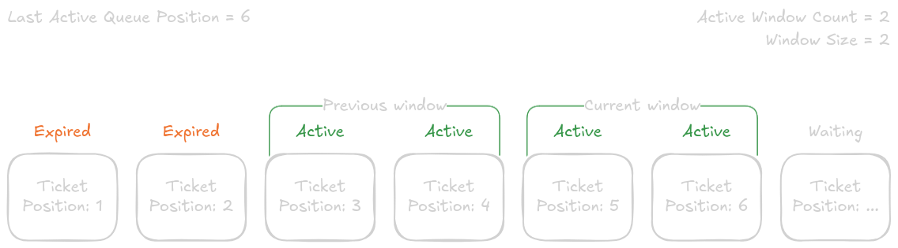

# System Design

The system provides a virtual waiting queue service, using ticket based rate limiting. It uses a sliding window solution to process tickets in batches. The solution has similar behaviour to those used by popular online retailers, such as Ticketmaster, for handling high demand events.

## Rate-limiting Algorithm
Users are assigned sequential tickets, implemented as JWTs, with a position (as the subject).
The server keeps track of two dynamic values, which are just integers in Redis:
- The next queue position, which is attached to the next requested ticket and then incremented
- The last queue position in the current active window  

Based on static variables (namely the window size and number of active windows), each ticket's state can be derived from its own position, as either:
- Expired: the ticket was issued before the current acive windows and is no longer active
- Active: the ticket is within the actve windows (ie less than the last active queue position, and greater than the lower bound)
- Waiting: the ticket position is greater than the last active queue position and not yet active

The last active queue position can then be incremented, by the window size, at a regular interval, thus sliding the window and processing the next batch of tickets.

## Leader Election
The system is distributed, so there is a leader election process to decide which server handles incrementing the window in Redis. All servers, regardless of leadership, can assign tokens and increment the queue position with ease, as the Redis `INCR` operation is atomic.
Each instance self-assigns a UUID on startup. Every time the instance then checks Redis for whether a window increment is due, it first checks leadership.
There is a leader key in Redis with the current leader ID as the value and a short TTL (to avoid broken nodes being considered leader for long periods). The instance will attempt to retrieve this value.
- If the value is not their ID, they are not leader. No action needed.
- If the value is their ID, they are leader. Extend the expiry and continue.
- If the value is not present and the leader has expired, there is no leader. Set own ID in Redis and continue as leader.

## API Surface
To interact with the system as a user, 2 HTTP endpoints are exposed:
- `POST /join`, which returns a ticket in the response body
- `GET /status`, which accepts a JWT ticket in the `Authorization` header and returns its status (expired, active or waiting)

## Considerations
By storing state on the client-side with JWTs and only integers server-side, the system is scalable and can handle very large queues.

For slow queues where the window is attempting to increment faster than people are joining queues (ie the next latest active queue position is greater than the current queue position), window increments are skipped until the queue catches up to avoid issuing expired tickets. This, however, leads to the edge case of a user requesting a ticket after a skipped incremement and the window almost instantly incrementing after, invalidating it. To avoid this, multiple active windows are recommended (at least 2), to allow spill-over from the previous batch whilst still preventing bursty traffic from very old tickets.